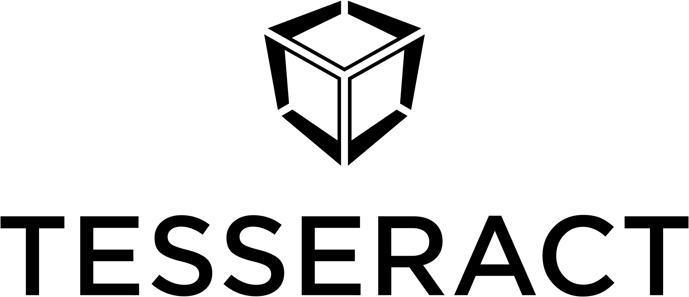

### **Tesseract.swift** is an implementation of [Tesseract](https://github.com/tesseract-one/) protocol for iOS. [Tesseract](https://github.com/tesseract-one/) seamlessly integrates dApps and wallets, regardless of the blockchain protocol.

#### **Tesseract** aims to improve the usability of the dApps without compromising security or decentralization.

This page is about specifics of running Tesseract on Android. If you need general info or Tesseract for another platform, please consider one of the following:
* [General info](https://github.com/tesseract-one/)
* [Tesseract for Android](https://github.com/tesseract-one/Tesseract.android)
* [Tesseract shared Core (Rust)](https://github.com/tesseract-one/Tesseract.rs)


## Getting started

**Tesseract** is implemented in Rust and currently doesn't provide the Swift wrappers, thus requiring some Rust coding. In the future, we aim to change it by offering wrappers, eliminating the need for any Rust code.

### Set up Rust

To add Rust, to your dApp or Wallet, please consider going through our guide [Setting up Rust](./RUST.MD). It contains the steps required to add Rust support to an iOS app + some useful interop utils description we've built.

### Initialize Tesseract Client

Once the Rust part is set up, you can proceed to setting up Tesseract:

```rust
use tesseract_utils::*;
use tesseract_client;

let tesseract = tesseract_client::Tesseract::new(
	tesseract_client::delegate::SingleTransportDelegate::arc(),
).transport(ipc_transport);
```

The initialization of Tesseract is essentially the same as it is described in the [Tesseract shared Core](tesseract-one/Tesseract.rs) except that to connect to a wallet via Tesseract, we need to specify the IPCTransport:

```rust
.transport(ipc_transport)
```

where `ipc_transport` is `transport::NativeTransport` passed to us from Swift.

#### Passing references from Swift:

The easiest way to call Rust from Swift is to create a C function and use `cbindgen` for export.

#### On the Swift side:

```swift
import TesseractClient
import CApp

let rustAppContext: AppContextPtr! = app_init(IPCTransportIOS().asNative())
```

#### On the Rust side:

```rust
use tesseract_utils::*;

// Pointer to our App Context (will be saved in the Swift for calls). Returns it as a struct with void* inside.
#[repr(C)]
pub struct AppContextPtr(SyncPtr<Void>);

#[no_mangle]
pub unsafe extern "C" fn app_init(transport: transport::NativeTransport) -> ManuallyDrop<AppContextPtr> {
	tesseract_utils_init();
	//your initialization here
}
```

The rest of Tesseract APIs stay exacly the same everywhere. Please, consider to go through the docs in our [Tesseract shared Core](https://github.com/tesseract-one/Tesseract.rs) repo.

## Usage

* [Main Rust API documentation](https://github.com/tesseract-one/Tesseract.rs)
* [Wallet developers documentation](./WALLET.MD)

Once we publish the Swift wrappers, the doc will appear here.

## Examples

You can find the examples (**Demo Wallet** and a **Demo dApp**) in this repo [HERE](./examples).

## Installation

### Prerequisites
* Install your Rust environment: https://www.rust-lang.org/tools/install
* Install Xcode from the App Store
* For Rust we suggest VS Code: https://code.visualstudio.com/

### On the Rust side you might need:

```toml
tesseract_utils = { git = "https://github.com/tesseract-one/Tesseract.swift", branch="master" } // utils for interop with Swift
tesseract_client = { git = "https://github.com/tesseract-one/Tesseract.swift", branch="master" } // iOS client integrations
tesseract = { git = "https://github.com/tesseract-one/Tesseract.rs", branch="master", features=["client"] } // Tesseract Core
```

### On the Swift side:

```swift
// Dependency
Package (
	dependencies: [
	 	.package(url: "https://github.com/tesseract-one/Tesseract.swift.git", .branch("master")),
	]
)

Target(
	dependencies: [ "TesseractClient" ]
)
```

### Setting up Rust interop:

Please, consider the guide [HERE](./RUST.MD).

## Roadmap

- [x] v0.1 - IPC transport for iOS - connect dApp/Wallet on the same device
- [x] v0.2 - demo dApp and Wallet
- [ ] v1.0 - iOS wrapper for Rust

## Changelog

* v0.2 - Created demo dApp and Wallet
* v0.1 - Created transport to connect dApp and Wallet

## License

Tesseract.android can be used, distributed and modified under [the Apache 2.0 license](LICENSE).
