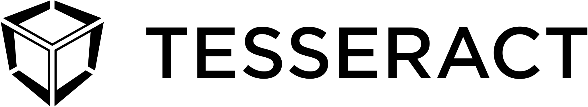

<p align="left">
	<a href="http://tesseract.one/">
		
	</a>
</p>

# Adding Rust to your iOS App

Create a new iOS application or open your existing project.

Copy Xcode build script from `examples/rust/xcode_build_step.sh` into your project (in this guide we assume that it is copied to the sources root folder).

Modify your target settings in the Xcode:
* Add `Run Script` phase to your target
* Move it before `Build Sources` phase
* Change script to `exec bash ${SRCROOT}/xcode_build_step.sh CApp app`. Where `CApp` is a name for the exported Swift module and `app` is a name of the rust library target in the `Cargo.toml`.

Add Package Dependency to the project: `https://github.com/tessetact-one/Tesseract.swift`

Create a rust library:
* `cargo new app --lib`
* Add the dependencies:
```toml
[dependencies]
tesseract_utils = { git = "https://github.com/tesseract-one/Tesseract.swift", branch = "master" }
tesseract_client = {  git = "https://github.com/tesseract-one/Tesseract.swift", branch = "master" }
tesseract = { git = "https://github.com/tesseract-one/Tesseract.rs", branch = "master", features = ["client"] }
tesseract-protocol-test = {git = "https://github.com/tesseract-one/Tesseract.rs", branch="master", features=["client"]}

[build-dependencies]
cbindgen = "0.24"
```
* specify the type of library
```
[lib]
crate-type = ["staticlib"]
```
* create `build.rs` file for C headers generation
```rust
extern crate cbindgen;

use std::env;
use std::path::Path;

fn main() {
    let crate_dir = env::var("CARGO_MANIFEST_DIR").unwrap();
    let profile = env::var("PROFILE").unwrap();
    let name = env::var("CARGO_PKG_NAME").unwrap();
    let header_path = Path::new(&crate_dir)
        .join("target")
        .join(&profile)
        .join("include")
        .join(format!("{}.h", name));

    cbindgen::generate(&crate_dir)
        .expect("Unable to generate bindings")
        .write_to_file(&header_path);
}
```
* Create `cbindgen.toml` file with this contents
```toml
include_version = true
autogen_warning = "/* Warning, this file is autogenerated by cbindgen. Don't modify this manually. */"
tab_width = 2
language = "C"
documentation_style = "C"
pragma_once = true
cpp_compat = true
after_includes = "@import CTesseractUtils;\n@import CTesseractClient;"

[enum]
prefix_with_name = true

[parse]
parse_deps = true
include = ["tesseract_utils", "tesseract_client"]

[export]
# We should exclude already exported types from CTesseractUtils and CTesseractClient
exclude = [
  "CFutureString", "SyncPtr_Void", "NativeTransport", "Void", 
  "CError", "CString", "CStringRef"
]
```

Load the native library:
```swift
import CApp
```

Now you can export C funcions, initialize Tesseract and start calling the Wallet.
